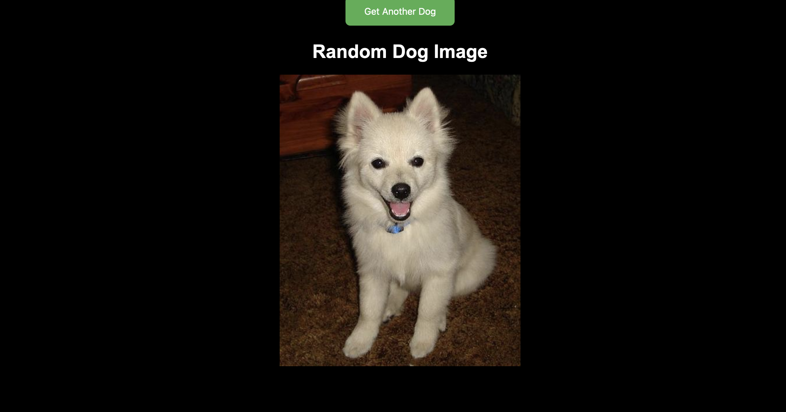

# Random Dog Image App

This is a simple web application built with Express.js and Node.js that fetches a random dog image from the [Dog CEO API](https://dog.ceo/dog-api/). Users can click a button to fetch another random dog image.

## Features

- Fetches a random dog image from the Dog CEO API.
- Allows users to get another random dog image by clicking a button.
- Responsive design.
- Hover effects added to the dog image and the button.



## Technologies Used

- Node.js
- Express.js
- HTML
- CSS

## Getting Started

To run this application locally, follow these steps:

1. Clone this repository to your local machine:

   ```bash
   git clone https://github.com/OrghoDeb/random-dog-image-generator.git
   ```

2. Navigate to the project directory:

   ```bash
   cd random-dog-image-generator
   ```

3. Install the dependencies:

   ```bash
   npm install
   ```

4. Run the application:

   ```bash
   npm start
   ```

5. Open web browser and visit `http://localhost:3000` to view the application.

## Contributing

Contributions are welcome! If you find any issues or have suggestions for improvements, please open an issue or create a pull request.

## License

This project is licensed under the [MIT License](LICENSE).
